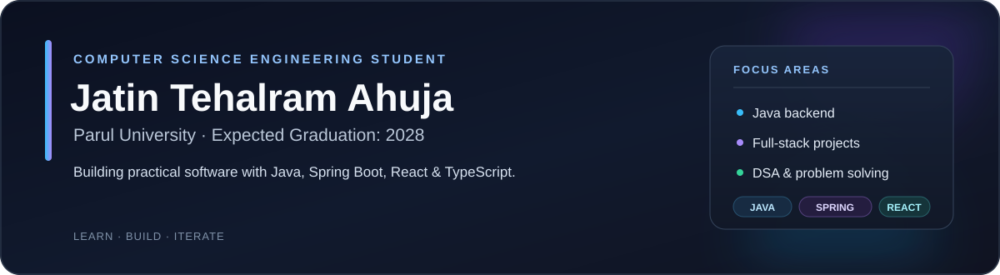

  
  
  
  

## 👋 Introduction

I’m a **Computer Science Engineering student at Parul University**, graduating in **2028**. I build practical software, practice data structures and algorithms, and am developing my skills in Java backend and full-stack web development.

| 🎯 Current focus | 🎓 Education |
| --- | --- |
| Java and Spring Boot backend development REST APIs and database-backed applications DSA and problem-solving patterns Readable code, testing, and useful documentation | **Parul University** Computer Science Engineering Expected graduation: **2028** |

## 🧰 Tech stack

| Area | Technologies |
| --- | --- |
| Languages |      |
| Frontend |    |
| Backend |    |
| Database |   |
| Tools |     |

## 📊 GitHub stats

<table>
  <tr>
    <td align="center" width="33%"><strong>159</strong> Contributions in the last year</td>
    <td align="center" width="33%"><strong>29</strong> Public repositories</td>
    <td align="center" width="33%"><strong>2</strong> Followers</td>
  </tr>
</table>

Profile snapshot checked October 5, 2026 · The live GitHub contribution graph appears below this README.

## 📌 Pinned repositories

<table>
  <tr>
    <td width="33%" valign="top">
      <h3><a href="https://github.com/2403051050553/Youtube-Clone">Youtube-Clone</a></h3>
      
Video-browsing homepage layout built with HTML and CSS, with original local SVG assets.

      <code>HTML</code> <code>CSS</code>
    </td>
    <td width="33%" valign="top">
      <h3><a href="https://github.com/2403051050553/NETFLIX-CLONE">NETFLIX-CLONE</a></h3>
      
Static streaming-service landing page concept built with HTML and CSS.

      <code>HTML</code> <code>CSS</code>
    </td>
    <td width="33%" valign="top">
      <h3><a href="https://github.com/2403051050553/jatin-portfolio">jatin-portfolio</a></h3>
      
Personal portfolio built with React, TypeScript, Vite, and Tailwind CSS.

      <code>React</code> <code>TypeScript</code> <code>Vite</code>
      
<a href="https://jatin-portfolio-eight-psi.vercel.app">Open the live portfolio ↗</a>

    </td>
  </tr>
  <tr>
    <td width="33%" valign="top">
      <h3><a href="https://github.com/2403051050553/LeetCode-Solutions">LeetCode-Solutions</a></h3>
      
Java algorithm practice with unit-tested array, string, and binary-search implementations.

      <code>Java</code> <code>Algorithms</code> <code>JUnit</code>
    </td>
    <td width="33%" valign="top">
      <h3><a href="https://github.com/2403051050553/SPOTIFY-CLONE">SPOTIFY-CLONE</a></h3>
      
Static Spotify-inspired music landing page concept built with HTML and CSS.

      <code>HTML</code> <code>CSS</code>
    </td>
    <td width="33%" valign="top">
      <h3><a href="https://github.com/2403051050553/student-grade-management">student-grade-management</a></h3>
      
Java 17 Spring Boot REST API for managing students and grades with JWT authentication and MySQL.

      <code>Java</code> <code>Spring Boot</code> <code>MySQL</code>
    </td>
  </tr>
</table>

GitHub displays the real, interactive contribution calendar directly below the profile README.

## 🔗 Connect

| Platform | Link |
| --- | --- |
| LinkedIn | [Jatin Tehalram Ahuja](https://www.linkedin.com/in/jatin-tehalram-ahuja-0386b5390/) |
| LeetCode | [2403051050553](https://leetcode.com/u/2403051050553/) |
| YouTube | [@JATINTEHALRAMAHUJA](https://www.youtube.com/@JATINTEHALRAMAHUJA) |
| Portfolio | [jatin-portfolio-eight-psi.vercel.app](https://jatin-portfolio-eight-psi.vercel.app) |
| Email | [2403051050553@paruluniversity.ac.in](mailto:2403051050553@paruluniversity.ac.in) |

Building practical software · Learning in public · Improving one project at a time

