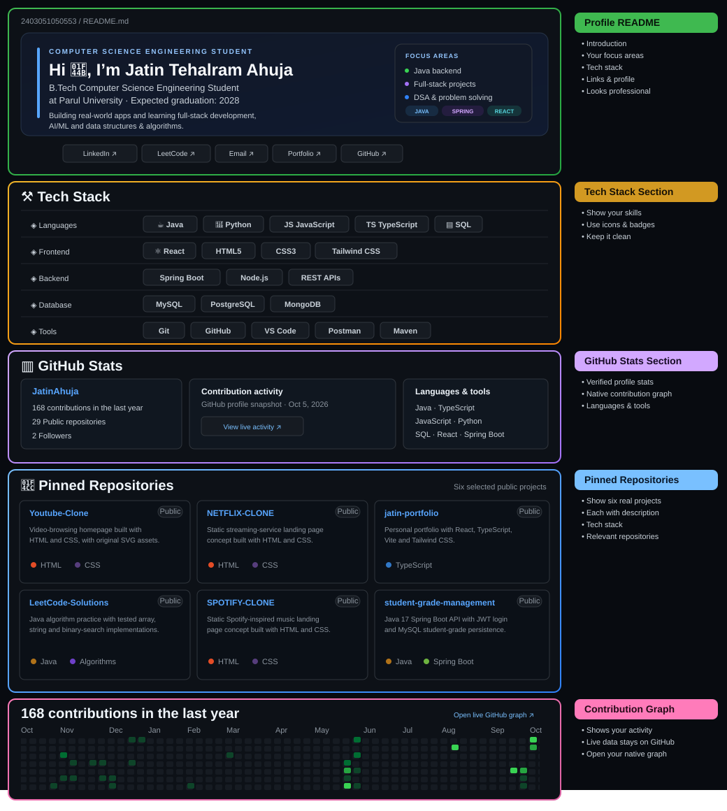

Accessible profile details and project links

## Introduction

🎓 **B.Tech CSE Student @ Parul University** 
💻 **Aspiring Software Engineer** 
🚀 **Building Full-Stack, AI & Scalable Applications** 
🧠 **DSA | Java | Spring Boot | React | SQL** 
📈 **Open to Internships & Opportunities**

## Tech stack

| Area | Technologies |
| --- | --- |
| Languages | Java, Python, JavaScript, TypeScript, SQL |
| Frontend | React, HTML5, CSS3 |
| Backend | Spring Boot, Node.js, REST APIs |
| Database | MySQL, PostgreSQL, MongoDB |
| Tools | Git, GitHub, VS Code, Postman, Maven |

## GitHub stats

Profile snapshot checked October 5, 2026: **29 public repositories** and **2 followers**. Contribution totals change as new work is published; GitHub’s live contribution calendar is displayed below this profile README.

## Pinned repositories

| Project | Description | Stack |
| --- | --- | --- |
| [Youtube-Clone](https://github.com/2403051050553/Youtube-Clone) | Video-browsing homepage layout with original SVG assets. | HTML, CSS |
| [NETFLIX-CLONE](https://github.com/2403051050553/NETFLIX-CLONE) | Static streaming-service landing page concept. | HTML, CSS |
| [jatin-portfolio](https://github.com/2403051050553/jatin-portfolio) | Personal portfolio built with React, TypeScript, Vite, and Tailwind CSS. [Live site](https://jatin-portfolio-eight-psi.vercel.app) | React, TypeScript, Vite |
| [LeetCode-Solutions](https://github.com/2403051050553/LeetCode-Solutions) | Java algorithm practice with tested array, string, and binary-search implementations. | Java, JUnit |
| [SPOTIFY-CLONE](https://github.com/2403051050553/SPOTIFY-CLONE) | Static Spotify-inspired music landing page concept. | HTML, CSS |
| [student-grade-management](https://github.com/2403051050553/student-grade-management) | Java 17 Spring Boot API with JWT authentication and MySQL. | Java, Spring Boot, MySQL |

## Contact

- [LinkedIn](https://www.linkedin.com/in/jatin-tehalram-ahuja-0386b5390/)
- [LeetCode](https://leetcode.com/u/2403051050553/)
- [YouTube](https://www.youtube.com/@JATINTEHALRAMAHUJA)
- [Portfolio](https://jatin-portfolio-eight-psi.vercel.app)
- [Email](mailto:2403051050553@paruluniversity.ac.in)

