<div align="center">

# JATIN TEHALRAM AHUJA

`Computer Science Engineering Student` · `AI` · `Full Stack` · `DSA`

<code>2403051050553@github ~ $ whoami</code>



</div>

---

## 👨‍💻 About Me

I am a **B.Tech Computer Science Engineering student at Parul University**, focused on building practical software, strengthening problem-solving skills, and exploring AI-powered applications.

```text
jatin@github ~ $ focus
AI / Full Stack Development / Data Structures & Algorithms

jatin@github ~ $ stack
Java · Python · JavaScript · SQL · React · Node.js · Spring Boot · Django

jatin@github ~ $ currently_learning
Advanced DSA · Backend Development · AI/ML · System Design
```

## 🧰 Tech Stack

| Area | Technologies |
|---|---|
| Languages | Java · Python · JavaScript · SQL · HTML · CSS |
| Frontend | React · JavaScript · HTML · CSS |
| Backend | Node.js · Spring Boot · Django |
| Databases | MySQL · MongoDB |
| Core CS | DSA · Algorithms · DBMS · Operating Systems · Computer Networks · OOP |
| Tools | Git · GitHub · VS Code · Postman |
| AI / Data | Python · NumPy · Pandas · AI/ML fundamentals |

## 🚀 What I Build

- Full-stack web applications with real database-backed functionality
- Java-based DSA and algorithm implementations
- Python-based data and AI experiments
- Practical academic and portfolio projects

## 🧠 DSA Focus

`Arrays` · `Strings` · `Hashing` · `Binary Search` · `Linked Lists` · `Stacks & Queues` · `Trees` · `Graphs` · `Dynamic Programming` · `Sorting & Searching`

## 📊 GitHub Activity

<code>2403051050553@github ~ $ ./contributions.sh</code>



> The contribution graph is refreshed automatically by GitHub Actions. The included data is a clean initial state; run the workflow once after pushing to populate it with your real public GitHub activity.

## 🎓 Education

**Parul University — Faculty of Engineering & Technology**  
B.Tech Computer Science Engineering · 5th Semester · CGPA: **7.04**

## 🔗 Connect

[](https://github.com/2403051050553)

## 📌 Profile Goals

I am continuously working on **DSA, software engineering, full-stack development, and AI/ML** while building projects that demonstrate practical problem-solving.

<div align="center">

<code>jatin@github ~ $ echo "build • learn • improve"</code>

</div>
